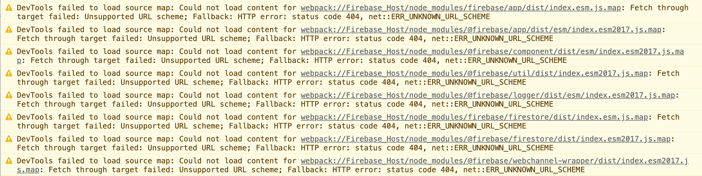

# Firebase
https://github.com/MeyerZhao/Firebase-Host/tree/FBS-05


```bash
# 安装依赖
$ npm install

# 编译 js 通过 webpack
$ npm run build

# 运行项目
$ npm start

# 部署项目
$ npm run deploy
```


## 设置 Firebase 托管

### 安装 Firebase CLI

要使用 Firebase 托管这项服务托管您的站点，您需要有 Firebase CLI（一个命令行工具）。

运行以下 [npm](https://www.npmjs.com/) 命令来安装 CLI 或更新到 CLI 最新版本。

```bash
$ npm install -g firebase-tools
```


### 初始化项目

请打开终端窗口，转到 Web 应用的根目录，或为 Web 应用创建根目录

**登录 Google**

```bash
$ firebase login
```

**启动项目**

```bash
$ firebase init
```


### 部署到 Firebase 托管

**准备就绪之后，请部署您的网络应用**
将您的静态文件（例如HTML、CSS、JS）放在您应用的部署目录中（默认为“public”）。然后，从该应用的根目录下运行此命令：

```bash
$ firebase deploy
```


### 上线之前使用预览渠道测试并分享更改

https://console.firebase.google.com/project/webteaching-96da1/hosting/sites


## FBS-05
https://www.youtube.com/watch?v=s1frrNxq4js&list=PL4cUxeGkcC9jERUGvbudErNCeSZHWUVlb&index=5

**删除文档**
https://firebase.google.com/docs/firestore/manage-data/delete-data?authuser=0

```js
import { doc, deleteDoc } from "firebase/firestore";

await deleteDoc(doc(db, "cities", "DC"));
```


## FBS-06

```js
// get collection data
// getDocs(colRef)
//   .then((data)=> {
//     let users = [];
//     data.docs.forEach((doc) => {
//       console.log('doc.data()', {...doc.data(), id: doc.id})
//       // users.push(doc.data())
//       // users.push(Object.assign(doc.data(), {id: doc.id}))
//       users.push({...doc.data(), id: doc.id})
//     })
//     console.log('users', users);
//   })
//   .catch(err => {
//     console.log(err.message)
//   })

// TODO: Real time collection data
onSnapshot(colRef, (snapshot) => {
  let users = [];
  snapshot.docs.forEach(doc => {
    users.push({...doc.data(), id: doc.id})
  })
  console.log('users', users)
})
```


## 问题集合

### webpack 编译的js 在浏览器有控制点有 warning 信息



**修复方式**

webpack.config.js

在 webpack 配置文件内添加 以下配置。

```js
devtool: "source-map",
```

## 工具集合

### mock data generator

https://towardsdatascience.com/free-resources-for-generating-realistic-fake-data-da63836be1a8

https://medium.datadriveninvestor.com/best-3-tools-for-generating-fake-data-a34a842f2acb

- https://cobbl.io/
- https://www.mockaroo.com/
- https://generatedata.com/generator
- https://www.onlinedatagenerator.com/